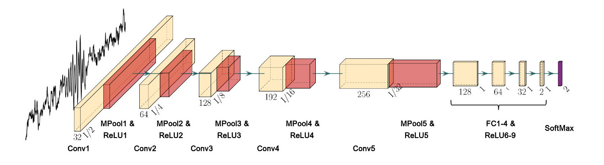

# CNNSpindleDetection
This is a MATLAB package to fit a Convolutional Neural Network (CNN) model (Figure 1) to detect sleep spindles. The detection process involves two steps: first, a singal-to-noise algorithm to detect a subset of high-quality sleep spindle examples, and second, a CNN training using example spindle activities to detect events throughout the recording.

| |
| :-: |
|**Figure 1:** The architecture of the CNN model developed for spindle detection.|

# Signal-to-noise ratio (SNR) measure
To specify a subset of spindles required to train the CNN model, a modified version of signal-to-noise ratio (SNR) algorithm (Muller et al., 2016) has been implemented. This algorithm, which is inspired by the adaptive, constant-false-alarm-rate (CFAR) technique in radar, was used to detect narrow-band rhythmic activities. The SNR measures the ratio of power within the frequency band of interest (here, 9-18 Hz) to power in the rest of the spectrum (1-100 Hz bandpass, with band-stop at 9-18 Hz). This measure is computed over a sliding window of time (here, 500 ms) and produces an estimate of how power in the frequency band of interest compares to total power in the recording, taking into account the noise on individual electrodes. To reduce the probability of false positives, the SNR threshold is set to the 99th percentile of the SNR distribution, thus detecting only the activity patterns that have the highest unique power concentration in the spindle frequency range. Additionally,, the SNR algorithm is required to only include activities with a duration between 0.5 to 3 seconds, consistent with the duration of sleep spindles. The detected windows are then used for training the CNN model.

# Convolutional neural network (CNN)
The application of CNN model for spindle detection is motivated by the successful implementation of convolutional networks for waveform detection with earthquakes and gravitational waves in high-noise settings (George and Huerta, 2018; Perol et al., 2018).  An architecture similar to the one proposed by (George and Huerta, 2018) with small modifications to the input and convolutional layers to take into account the basic features of the spindle rhythm in cortex (e.g. average duration) has been implemented in this package. The CNN model takes a sliding window of sleep recording (here, 500 ms which is bandpass filtered at 1-100 Hz after removal of line noise and harmonics) as an input and predicts its label (spindle or non-spindle).

# Parameter Setting
The SNR algorithm and CNN architecture should be tailored with respect to the duration of rhythmic activity, type of oscillation and sampling rates of recording modality. The duration of the rhythmic activity and sampling rate determine the length of the sliding window. For example, in spindle detection, the sliding window is set to 0.5 sec which is the minimum duration of spindle activities observed during sleep and with the sampling rate of 1000 Hz, it contains 500 data points. The next step is to specify the filter size with respect to the length of the sliding window and types of rhythmic activity. The CNN layer is designed to start by extracting local features, gradually extracting longer-timescale features by decreasing the feature space. It turns out that a filter size which covers approximately up to one oscillation cycle (here, 70-120 msec) is effective in detecting spindle activity. The current CNN architecture works perfectly with slight changes in the sliding window (duration and sampling rate) and type of oscillation but it requires modification otherwise.

This two-step training protocol is applicable to general timeseries data obtained in fields across biology. It can efficiently learn to detect the specific waveform characteristics of the oscillation and works well on recordings with very different electrode types and spatial sampling (ranging from scalp EEG to invasive intracranial depth electrodes). It demonstrates the promise of this computational tool for analysis of other rhythmic waveforms that may be of interest in high-noise biological recordings.  An example spindle detection set up is provided in demo.m.

# Acknowledgements
This implementation builds on the CNN model described in Mofrad et al., 2022.
